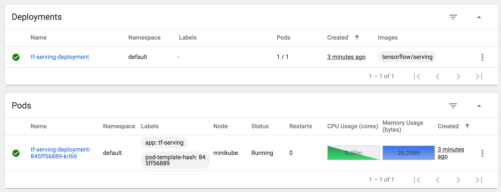
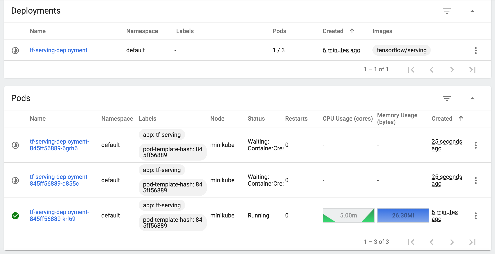
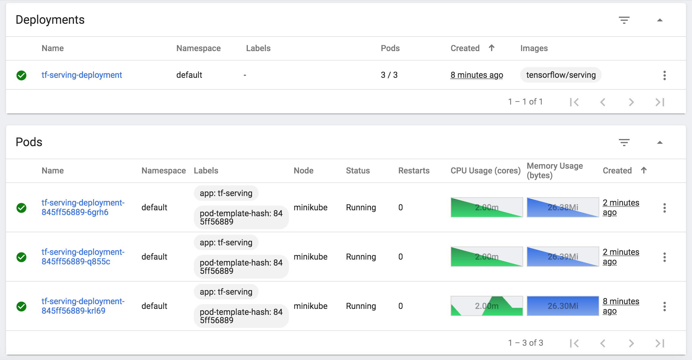

# Deploying ML models using FastAPI and Docker


## Dataset

For this repo, we are going to work with the following dataset:

https://archive.ics.uci.edu/ml/datasets/Breast+Cancer+Wisconsin+(Diagnostic)

Features are computed from a digitized image of a fine needle aspirate (FNA) of a breast mass. They describe characteristics of the cell nuclei present in the image.
n the 3-dimensional space is that described in: [K. P. Bennett and O. L. Mangasarian: "Robust Linear Programming Discrimination of Two Linearly Inseparable Sets", Optimization Methods and Software 1, 1992, 23-34].

### Attribute Information:

1) ID number
2) Diagnosis (M = malignant, B = benign)

Ten real-valued features are computed for each cell nucleus:
```
a) radius (mean of distances from center to points on the perimeter)
b) texture (standard deviation of gray-scale values)
c) perimeter
d) area
e) smoothness (local variation in radius lengths)
f) compactness (perimeter^2 / area - 1.0)
g) concavity (severity of concave portions of the contour)
h) concave points (number of concave portions of the contour)
i) symmetry
j) fractal dimension ("coastline approximation" - 1)
```
## Preparing the environment

1. Clone the repository, and navigate to the downloaded folder.
```
git clone https://github.com/iamirmasoud/fastapi_ml_docker
cd fastapi_ml_docker
```

2. Create (and activate) a new environment, named `fastapi_ml` with Python 3.7. If prompted to proceed with the install `(Proceed [y]/n)` type y.

	```shell
	conda create -n fastapi_ml python=3.7
	source activate fastapi_ml
	```
	
	At this point your command line should look something like: `(fastapi_ml) <User>:fastapi_ml_docker <user>$`. The `(fastapi_ml)` indicates that your environment has been activated, and you can proceed with further package installations.

3. Before you can experiment with the code, you'll have to make sure that you have all the libraries and dependencies required to support this project. You can install dependencies using:
```bash
pip install -r requirements.txt
```


# Train

After installing all the dependencies we can now run the script in code/train.py, this script takes the input data and outputs a trained model and a pipeline for our web service.

```bash
python code/train.py
```

## Web application

Finally, we can test our web application by running:

```bash
uvicorn main:app
```

## Docker

Now that we have our web application running, we can use the Dockerfile to create an image for running our web application inside a container

```bash
docker build . -t ml_fastapi_docker
```

And now we can test our application using Docker

```bash
docker run -p 8000:8000 ml_fastapi_docker
```

## docker-compose

I also wrote the docker-compose file to mount our model and run our service.We will be using the model that we trained earlier. We can copy it to our `/var/tmp` directory, so we'll have a common directory to mount to the VM. We can use the command below for Mac and Linux:

```bash
cp -R ./model /var/tmp
```

then run the following docker-compose command:

```bash
docker-compose up
```


## Test!

Run the following commands in terminal or run the `tests/client.py` script:


```bash
# GET method info
curl -XGET http://localhost:8000/info

# GET method health
curl -XGET http://localhost:8000/health

# POST method predict
curl -H "Content-Type: application/json" -d '{
  "concavity_mean": 0.3001,
  "concave_points_mean": 0.1471,
  "perimeter_se": 8.589,
  "area_se": 153.4,
  "texture_worst": 17.33,
  "area_worst": 2019.0
}' -XPOST http://0.0.0.0:8000/predict
```

# Bonus Section: Deploying on Kubernetes

* setup Kubernetes in our local machine for learning and development
* create Kubernetes objects using YAML files
* deploy containers
* access the deployment using a Nodeport service
* autoscale the deployment to dynamically handle incoming traffic 

## Installation

First, we will setup our machine to run a local Kubernetes cluster. It's a great tool for learning and for local development as well. There are several Kubernetes distributions and the one best suited for our purpose is [Minikube](https://minikube.sigs.k8s.io/docs/). 


You will need to install the following tools:

* **curl** - a command-line tool for transferring data using various network protocols. You may have a already installed this but in case you haven't, [here is one reference](https://reqbin.com/Article/InstallCurl) to do so. You will use this to query your model later.

* **Virtualbox** - Minikube is meant to run in a virtual machine (VM) so you will need virtualization software to act as the VM driver. While you can also specify `docker` as the VM driver, we found that it has limitations, so it's best to use Virtualbox instead. Installation instructions can be found [here](https://www.virtualbox.org/wiki/Downloads). When prompted by your OS, make sure to allow network traffic for this software, so you won't have firewall issues later on.

* **kubectl** - the command line tool for interacting with Kubernetes clusters. Installation instructions can be found [here](https://kubernetes.io/docs/tasks/tools/)

* **Minikube** - a Kubernetes distribution geared towards new users and development work. It is not meant for production deployments however since it can only run a single node cluster on our machine. Installation instructions [here](https://minikube.sigs.k8s.io/docs/start/).


## Architecture

The application we'll be building will look like the figure below:


We will create a deployment that spins up containers that runs a model server. In this case, that will be from the `ml_fastapi_docker` image we already used in the section. The deployment can be accessed by external terminals (i.e. our users) through an exposed service. This brings inference requests to the model servers and responds with predictions from our model.

Lastly, the deployment will spin up or spin down pods based on CPU utilization. It will start with one pod but when the load exceeds a pre-defined point, it will spin up additional pods to share the load.

## Start Minikube

We are now almost ready to start our Kubernetes cluster. There is just one more additional step. As mentioned earlier, Minikube runs inside a virtual machine. That implies that the pods we will create later on will only see the volumes inside this VM. Thus, if we want to load a model into our pods, then we should first mount the location of this model inside Minikube's VM. Let's set that up now.

We will be using the model that we trained earlier. We can copy it to our `/var/tmp` directory, so we'll have a common directory to mount to the VM. We can use the command below for Mac and Linux:

```bash
cp -R ./model /var/tmp
```


Now we're ready to start Minikube! Run the command below to initialize the VM with Virtualbox and mount the folder containing our model file:


```bash
minikube start --mount=True --mount-string="/var/tmp:/var/tmp" --vm-driver=virtualbox
```
```bash
 minikube mount /var/tmp:/var/tmp
```

## Creating Objects with YAML files

In the official Kubernetes basics tutorial, you mainly used `kubectl` to create objects such as pods, deployments, and services. While this definitely works, our setup will be more portable and easier to maintain if we configure them using [YAML](https://yaml.org/spec/1.2/spec.html) files. I've included these in the `yaml` directory of this ungraded lab, so we can peruse how these are constructed. The [Kubernetes API](https://kubernetes.io/docs/reference/kubernetes-api/) also documents the supported fields for each object. For example, the API for Pods can be found [here](https://kubernetes.io/docs/reference/kubernetes-api/workload-resources/pod-v1/).

One way to generate this when we don't have a template to begin with is to first use the `kubectl` command then use the `-o yaml` flag to output the YAML file for us. For example, the [kubectl cheatsheet](https://kubernetes.io/docs/reference/kubectl/cheatsheet/) shows that we can generate the YAML for a pod running an `nginx` image with this command:

```bash
kubectl run nginx --image=nginx --dry-run=client -o yaml > pod.yaml
```

All objects needed, are already provided, and you are free to modify them later when you want to practice different settings. Let's go through them one by one in the next sections.

### Config Maps

First, we will create a [config map](https://kubernetes.io/docs/concepts/configuration/configmap/) that defines a `MODEL_NAME` and `MODEL_PATH` variable. This is needed because of how the docker image is configured. 

It basically starts up the model server and uses the environment variables `MODEL_BASE_PATH` and `MODEL_NAME` to find the model. Though we can explicitly define this as well in the `Deployment` YAML file, it would be more organized to have it in a configmap, so we can plug it in later. Please open `yaml/configmap.yaml` to see the syntax.

We can create the object now using `kubectl` as shown below. Notice the `-f` flag to specify a filename. We can also specify a directory but we'll do that later.

```bash
kubectl apply -f yaml/configmap.yaml
```

With that, you should be able to `get` and `describe` the object as before. For instance, `kubectl describe cm mlserving-configs` should show you:

```
Name:         mlserving-configs
Namespace:    default
Labels:       <none>
Annotations:  <none>

Data
====
MODEL_NAME:
----
breast_model
MODEL_PATH:
----
/model/model_binary.dat.gz

BinaryData
====

Events:  <none>
```

### Create a Deployment

#### (Optional): Build and use the local docker images for minikube 
To use a docker image without uploading it, you can follow these steps:

- Set the environment variables with `eval $(minikube docker-env)`
- Build the image with the Docker daemon of Minikube (e.g. `docker build -t ml_fastapi_docker .`)
- Set the image in the pod spec like the build tag (e.g. my-image)
- Set the `imagePullPolicy` to `Never`, otherwise Kubernetes will try to download the image.
- **Important note**: You have to run eval `$(minikube docker-env)` on each terminal you want to use, since it only sets the environment variables for the current shell session.

#### Creating deployment
We will now create the deployment for our application. Please open `yaml/deployment.yaml` to see the spec for this object. You will see that it starts up one replica, uses `localhost:5000/ml_fastapi_docker:latest` as the container image and defines environment variables via the `envFrom` tag. It also exposes port `8000` of the container because we will be sending HTTP requests to it later on. It also defines cpu and memory limits and mounts the volume from the Minikube VM to the container.

As before, we can apply this file to create the object:

```bash
kubectl apply -f yaml/deployment.yaml
```

Running `kubectl get deploy` after around 90 seconds should show you something like below to tell you that the deployment is ready.

```
NAME                    READY   UP-TO-DATE   AVAILABLE   AGE
ml-serving-deployment   1/1     1            1           15s
```

Troubleshooting commands: 

```bash
kubectl get pods
kubectl describe pods
kubectl logs -f deployments/ml-serving-deployment
```


### Expose the deployment through a service

We will need to create a service so our application can be accessible outside the cluster. I've included `yaml/service.yaml` for that. It defines a [NodePort](https://kubernetes.io/docs/concepts/services-networking/service/#nodeport) service which exposes the node's port `30001`. Requests sent to this port will be sent to the containers' specified `targetPort` which is `8000`. 

Apply `yaml/service.yaml`:
```bash
kubectl apply -f yaml/service.yaml
```
and run 
```bash
kubectl get svc ml-serving-service
```

You should see something like this:

```
NAME                 TYPE       CLUSTER-IP     EXTERNAL-IP   PORT(S)          AGE
ml-serving-service   NodePort   10.102.161.7   <none>        8000:30001/TCP   20m
```

We can try accessing the deployment now as a sanity check. The following `curl` command will send a row of inference requests to the Nodeport service:

```bash
curl -H "Content-Type: application/json" -d '{
  "concavity_mean": 0.3001,
  "concave_points_mean": 0.1471,
  "perimeter_se": 8.589,
  "area_se": 153.4,
  "texture_worst": 17.33,
  "area_worst": 2019.0
}' -XPOST $(minikube ip):30001/predict
```

If the command above does not work, you can run `minikube ip` first to get the IP address of the Minikube node. It should return a local IP address like `192.168.59.101`. You can then plug this in the command above by replacing the `$(minikube ip)` string. For example:

```bash
curl -H "Content-Type: application/json" -d '{
  "concavity_mean": 0.3001,
  "concave_points_mean": 0.1471,
  "perimeter_se": 8.589,
  "area_se": 153.4,
  "texture_worst": 17.33,
  "area_worst": 2019.0
}' -XPOST 192.168.59.101:30001/predict
```


If the command is successful, you should see the results returned by the model:

```
{"label":"M","prediction":1}
```

Great! Our application is successfully running and can be accessed outside the cluster!

### Horizontal Pod Autoscaler

One of the great advantages of container orchestration is it allows us to scale our application depending on user needs. Kubernetes provides a [Horizontal Pod Autoscaler (HPA)](https://kubernetes.io/docs/tasks/run-application/horizontal-pod-autoscale/) to create or remove replicasets based on observed metrics. To do this, the HPA queries a [Metrics Server](https://kubernetes.io/docs/tasks/debug-application-cluster/resource-metrics-pipeline/#metrics-server) to measure resource utilization such as CPU and memory. The Metrics Server is not launched by default in Minikube and needs to be enabled with the following command:

```bash
minikube addons enable metrics-server
```

You should see a prompt saying `🌟  The 'metrics-server' addon is enabled
` shortly. This launches a `metrics-server` deployment in the `kube-system` namespace. Run the command below and wait for the deployment to be ready.

```bash
kubectl get deployment metrics-server -n kube-system
```

You should see something like:

```
NAME             READY   UP-TO-DATE   AVAILABLE   AGE
metrics-server   1/1     1            1           76s
```

With that, we can now create our autoscaler by applying `yaml/autoscale.yaml`. Please wait for about a minute, so it can query the metrics server. Running `kubectl get hpa` should show: 

```
NAME             REFERENCE                          TARGETS   MINPODS   MAXPODS   REPLICAS   AGE
ml-serving-hpa   Deployment/ml-serving-deployment   0%/2%    1         3         1          38s

```

If it's showing `Unknown` instead of `0%` in the `TARGETS` column, you can try sending a few curl commands as you did earlier then wait for another minute.


### Stress Test


To test the autoscaling capability of our deployment, I provided a short bash script (`request.sh`) that will just persistently send requests to our application. Please open a new terminal window, make sure that you're in the root directory of this README file, then run this command (for Linux and Mac):

```bash
/bin/bash request.sh
```


You should see results being printed in quick succession.

If you're seeing connection refused, make sure that our service is still running with `kubectl get svc ml-serving-service`.

### Dashboard
There are several ways to monitor this but the easiest would be to use Minikube's built-in dashboard. We can launch it by running:

```
minikube dashboard
```

If you launched this immediately after you ran the request script, you should initially see a single replica running in the `Deployments` and `Pods` section:



After about a minute of running the script, you will observe that the CPU utilization will reach 5 to 6m. This is more than the 20% that we set in the HPA so it will trigger spinning up the additional replicas:



Finally, all 3 pods will be ready to accept request and will be sharing the load. See that each pod below shows `2.00m` CPU Usage.



We can now stop the `request.sh` script by pressing `Ctrl/Cmd + C`. Unlike scaling up, scaling down the number of pods will take longer before it is executed. You will wait around 5 minutes (where the CPU usage is below 1m) before you see that there is only one pod running again. This is the behavior for the `autoscaling/v1` API version we are using. There is already a `v2` in the beta stage being developed to override this behavior and you can read more about it [here](https://kubernetes.io/docs/tasks/run-application/horizontal-pod-autoscale/#api-object).

### Tear Down

After we're done experimenting, we can destroy the resources we created. We can simply call `kubectl delete -f yaml` to delete all resources defined in the `yaml` folder. You should see something like this:

```
horizontalpodautoscaler.autoscaling "ml-serving-hpa" deleted
configmap "mlserving-configs" deleted
deployment.apps "ml-serving-deployment" deleted
service "ml-serving-service" deleted
```

We can then re-create them all next time with one command by running `kubectl apply -f yaml`. Just remember to check if `metrics-server` is enabled and running.

If we also want to destroy the VM, then we can run `minikube delete`. 

